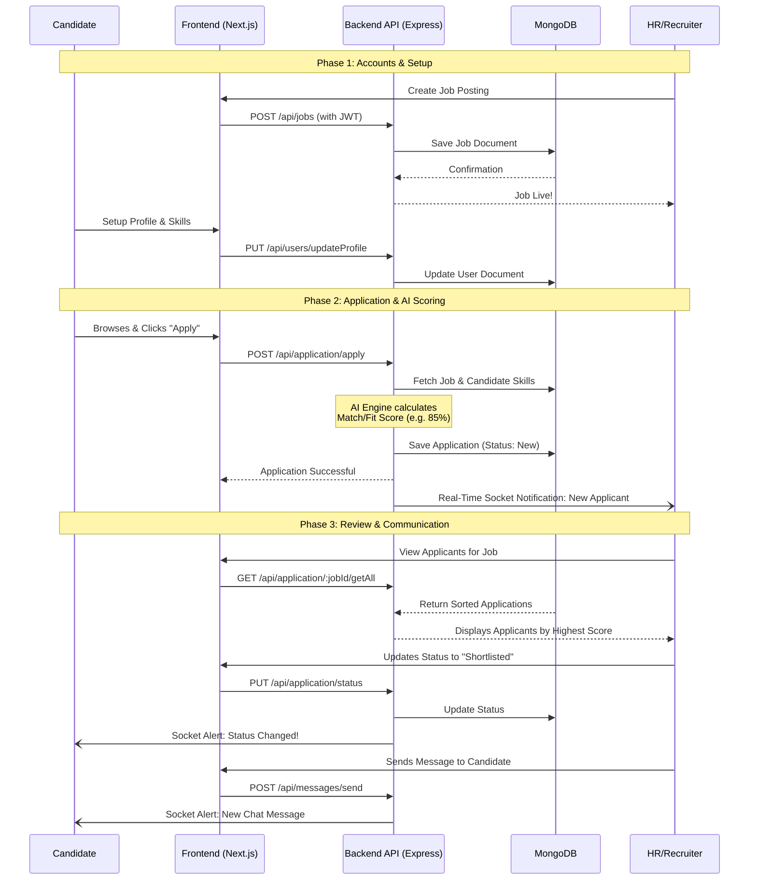

# HireFilter - Project Flow Documentary

This document provides a comprehensive overview of the **HireFilter** platform, explaining the complete end-to-end flow of the project. It maps out exactly how data moves through your application and how the different user roles interact with the system.

## 1. Executive Summary
HireFilter is an AI-Powered Recruitment and Applicant Tracking System (ATS). It operates as a two-sided marketplace connecting **Candidates** (job seekers) with **HRs** (recruiters), overseen by **Administrators**. 
The platform stands out by using AI for resume parsing, candidate matching, skill scoring, and intelligent career guidance via a built-in Chatbot.

---

## 2. Core User Roles
1. **Candidate:** Build profiles, search for jobs, take assessments, and track their application statuses.
2. **HR / Recruiter:** Post jobs, review AI-scored applications, shortlist candidates, and communicate via real-time messaging.
3. **Admin:** Monitor system health, manage users, and observe platform analytics.

---

## 3. High-Level System Architecture

The project follows a modern decoupled architecture:
- **Frontend:** Next.js (App Router), React, TailwindCSS, Framer Motion for animations.
- **Backend API:** Node.js, Express.js deployed on Render (`hire-filter-backend`).
- **Database:** MongoDB (via Mongoose).
- **Real-Time Engine:** Socket.io (for instant messaging and notifications).

---

## 4. The Candidate Journey (End-to-End Flow)

This is the exact sequence of events a job seeker experiences on HireFilter:

1. **Onboarding:**
   - The candidate lands on the 3D interactive homepage.
   - They navigate to **Register** and sign up as a `user`. 
   - *Backend Action:* An OTP is sent via Nodemailer. Upon verification, the user is saved to MongoDB and a JWT token is issued.
   
2. **Profile Setup (`/candidate/profile`):**
   - The candidate builds their resume natively by adding `skills`, `experience`, `education`, and `contact info`. 
   - They can upload a highly-polished PDF resume and a profile avatar (handled via Multer & Cloudinary).

3. **Job Discovery & AI Guidance (`/candidate/find-jobs` & `/candidate/guidance`):**
   - The candidate browses available jobs. 
   - They can optionally chat with the **AI Assistant** (Chatbot) to get tailored career advice or use the **Resume Analyzer** (`/candidate/resume/analysis`) to see how their profile scores against industry standards (Technical Skills, Formatting, Keywords).

4. **Application Submission:**
   - The candidate finds a job and clicks **Apply**.
   - *Backend Action:* The backend instantly cross-references the candidate's skills with the job's `requiredSkills` to calculate an initial **Match Score** (e.g., 85%). An `Application` record is created.

5. **Tracking & Communication (`/candidate/dashboard`):**
   - The candidate tracks their application moving through states: `Applied` ➔ `Screening` ➔ `Shortlisted` ➔ `Hired` (or `Rejected`).
   - If HR initiates a chat, the candidate receives real-time notifications and can chat directly via the integrated messaging system.

---

## 5. The HR / Recruiter Journey (End-to-End Flow)

This illustrates how a recruiter interacts with the platform:

1. **Job Creation (`/hr/jobs/create`):**
   - HR logs in and accesses the dashboard.
   - They create a new job posting specifying `Title`, `Department`, `Required Skills`, `Salary`, and `Experience`.
   - *Backend Action:* Validated via strict Joi schemas and saved to MongoDB.

2. **Application Review (`/hr/applicants/[jobId]`):**
   - As candidates apply, HR opens the applicant pipeline.
   - Candidates are **automatically sorted and scored** using the AI ranking engine based on skill overlaps between the job and the candidate's profile.

3. **Resume Analysis & Shortlisting (`/hr/resume-analyzer` & `/hr/shortlist`):**
   - HR utilizes the Resume Analyzer to extract deep insights from uploaded PDFs.
   - Based on the Fit Score, HR adds top talent to their **Shortlist**.

4. **Status Updates & Hiring:**
   - HR updates application statuses (e.g., changing from `New` to `Shortlisted`).
   - *Real-time Action:* Socket.io instantly pushes this status update to the Candidate's dashboard.
   - HR makes the final decision (`Hired`).

---

## 6. Visualizing the complete System Flow

Below is a visual representation of how the entire system interacts in a typical recruitment lifecycle.

## 7. Key Algorithmic Logic
- **Skill Matching (Fit Score):** The core value proposition of HireFilter revolves around `calculateScore()`. This function takes the `job.skills` array and intersects it with the `candidate.skills` array. It calculates a normalized percentage indicating how perfectly the candidate matches the job's requirements, fundamentally minimizing the time HR spends reviewing unqualified resumes. 
- **Strict Data Validation:** The backend uses rigid schemas to map user inputs. Attempting to force unauthorized data (like modifying an application's `status` illegally) is strictly rejected (400 Bad Request), enforcing data integrity.
