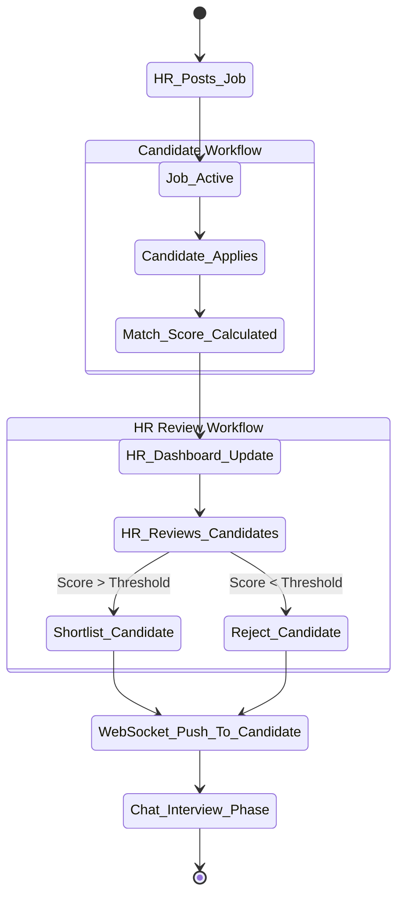
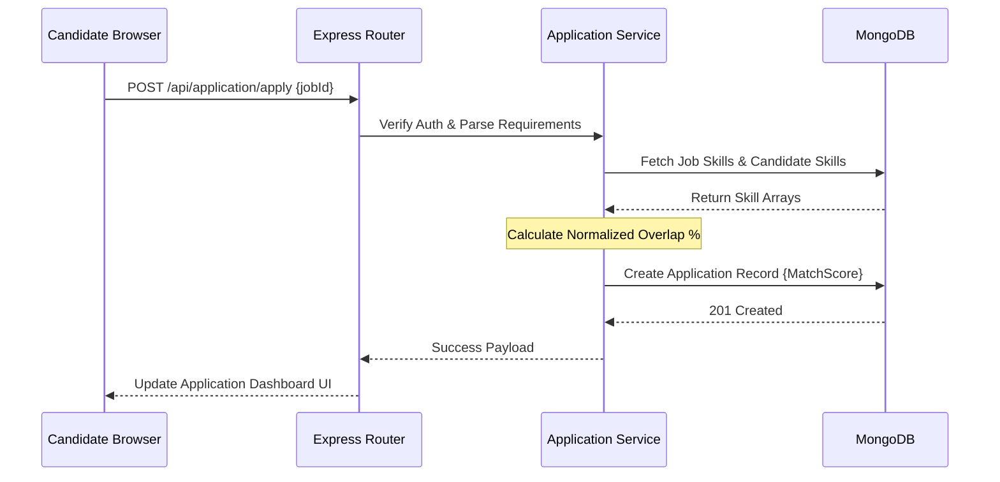

# Title
**HireFilter: An AI-Powered Recruitment and Applicant Tracking System**

## Abstract
Traditional recruitment involves countless hours of manual application parsing, inefficient communication channels with candidates, and disorganized applicant tracking systems. **HireFilter** aims to revolutionize the process by integrating an AI-driven matching algorithm that scores candidate skills against job requirements automatically. Paired with a robust real-time messaging system (Socket.io) and dual contextual dashboards for HRs and Candidates, HireFilter minimizes "Time-to-Hire" (TTH) and improves the candidate experience significantly. 

## Introduction

### Problem Statement
Human resources professionals struggle with high application volumes containing unstructured data, making objective candidate assessment difficult and slow. On the flip side, candidates face black-hole application processes with minimal transparency or communication out-times. Furthermore, existing enterprise applicant tracking systems are prohibitively expensive for small-to-medium businesses.

### Objectives
1. **Automated Assessment:** Implement an AI-driven fit-scoring algorithm to objectively rank applications.
2. **Instant Communication:** Build a resilient real-time messaging pipeline bridging Candidates and Recruiters directly.
3. **Data Transparency:** Offer dual-role dashboards showcasing live application status pipelines (Applied ➔ Shortlisted ➔ Hired).
4. **Enhanced Candidate Support:** Offer AI Chatbot guidance and resume analyzer tools to help candidates navigate paths.

### Scope
The project focuses on building a web-based portal facilitating Job Postings, Profile Management, automated Application Ranking, and Peer-to-Peer messaging. It encompasses three distinct roles: 
- **Candidate:** Creating detailed profiles, taking resume analysis tests, and managing their applications.
- **HR/Recruiter:** Publishing jobs, managing shortlists based on algorithm scores, and initiating chat interviews.
- **System Admin:** Overseeing overall platform health metrics.

## Literature Review / Market Survey
A survey of major ATS platforms (Workday, Greenhouse, Workable) reveals a highly fragmented market. While large enterprise solutions provide automated ranking tools via deep integrations, they lack user-friendly, out-of-the-box native real-time chat and often operate with delayed email-based interactions. Smaller businesses resort to generic email inboxes which makes filtering impossible. Recent advancements in Natural Language Processing (NLP) models indicate a strong industry push towards utilizing machine intelligence for resume screening. **HireFilter** uniquely consolidates automated resume analysis alongside contextual live chats to cater to modern hiring workflows specifically for mid-market teams.

## Proposed Solution/Methodology
HireFilter adopts an **MRCSR (Model-Route-Controller-Service-Repository)** pattern backend accompanied by a highly reactive **Next.js frontend**. The system heavily maps out business entities across dedicated RESTful protocols, while using a standalone WebSocket cluster for concurrent event handling (like status updates and text chats). The skill-matching methodology normalizes JSON arrays containing candidate skills against employer requirements, outputting a mathematical Fit Percentage per candidate without invoking systemic bias.

### 1. Use Case Diagram
This outlines what each actor in the system can actually do.
```mermaid
usecaseDiagram
    actor Candidate
    actor HR
    actor Admin

    package "HireFilter Platform" {
        usecase "Manage User Profile" as U1
        usecase "Apply for Job" as U2
        usecase "View Career Guidance / Analyze Resume" as U3
        
        usecase "Post & Manage Jobs" as U4
        usecase "Review Applicants (AI Sorted)" as U5
        usecase "Update Applicant Status" as U6
        
        usecase "Communicate in Real-Time" as U7
        usecase "View System Analytics" as U8
    }

    Candidate --> U1
    Candidate --> U2
    Candidate --> U3
    Candidate --> U7
    
    HR --> U4
    HR --> U5
    HR --> U6
    HR --> U7
    
    Admin --> U8
```

### 2. Activity Diagram
This demonstrates the workflow loop when HR creates a job and a Candidate is shortlisted.


### 3. Sequence/Flow Diagram
This explains the backend request lifecycle for the core scoring engine.


## Tools/Technologies/Hardware
**Frontend Applications:**
- **Framework:** Next.js (App Router), React 18
- **Styling:** Tailwind CSS, PostCSS
- **Animations / 3D:** Framer Motion, Splinetool React (for rendering interactive homepages)
- **State Management:** React Context API (JobContext, ChatbotContext)

**Backend Architecture:**
- **Runtime Environment:** Node.js, Express.js
- **Real-Time Communications:** Socket.io
- **Security:** JWT (JSON Web Tokens), bcryptjs, express-mongo-sanitize

**Data & Cloud Storage:**
- **Database:** MongoDB (using Mongoose ODM)
- **Asset Storage:** Cloudinary (for resumes & avatars), Multer (local parsing)

## Tentative Timeline and Work Plan
1. **Week 1-2 (Requirement & Architecture):** Project Scope finalization, DB Schema design (MongoDB Collections), wireframing interactive dashboards. 
2. **Week 3-4 (Backend & Auth):** Complete JWT Authentication, basic REST APIs, and role-based access control (RBAC).
3. **Week 5-7 (Core App Logic):** Implement Job posting engine, Applicant Tracking module, and the core Skill Matching algorithms. Integration of Next.js frontend pages.
4. **Week 8 (Real-Time Subsystem):** Build out Socket.io event hooks, private chat rooms, and the instant application-status alert system.
5. **Week 9 (AI Chatbot & Polish):** Integrate the floating Assistant chatbot contextual logic, apply Framer Motion layout transitions.
6. **Week 10 (Testing & Deployment):** End-to-end bug fixing (e.g., Joi validation hardening), load testing, deploying Express Server to Render and Frontend to Vercel/Netlify.

## Expected Outcomes
- A fully functional, responsive job portal accessible to Candidates, HRs, and Admins.
- An intelligent sorting mechanism that vastly reduces HR review times down to seconds using pre-computed skill mapping.
- 100% transparency for candidates tracing application journeys in real-time.
- Decreased system lag and reduced bounce rates achieved via App-level route optimization and non-blocking Socket events.

## Ethical, Legal, and Environmental Considerations

**Ethical:**
- **Unbiased Hiring Algorithms:** The matching logic strictly compares empirical skill sets (e.g., "React", "Python") without factoring in names, age, location, or gender identifiers, effectively mitigating human screening bias.

**Legal:**
- **Data Privacy & GDPR Security:** The platform utilizes secure HTTP-only configurations for sensitive authentications (JWT), relies on `bcrypt` for encrypted password storage, and prevents NoSQL injection via sanitization hooks—ensuring applicant PII (Personally Identifiable Information) remains protected.
- **Data Erasure:** Complete candidate account deletion cascades cleanly across the database satisfying "Right to be Forgotten" mandates.

**Environmental:**
- Utilizing Serverless & scaling architectures (like Vercel and Render) ensures that compute environments scale purely based on traffic rather than leaving resource-heavy dedicated metal servers perpetually oscillating. High cacheability via Next.js static asset rendering also minimizes server power loads per client visit.
